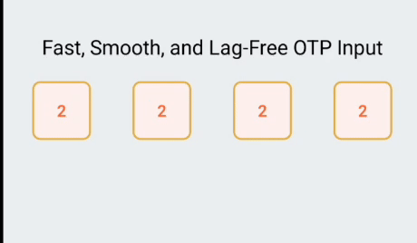

# react-native-otp-manager 


## 📦 Overview

`react-native-otp-manager` is a lightweight, fully customizable OTP input component for React Native. Designed with performance and UX in mind, it provides a smooth OTP entry experience without lags — perfect for mobile verification flows.


## ✨ Features

- ✅ Smooth & Lag-Free Input
- 🎨 Fully Customizable UI & Styles
- 🔐 Secure Entry Support
- ⚡ OTP Autofill & AutoFocus
- 🌓 Dark Mode Ready
- 💯 Built with TypeScript
- ✅ Works with both **React Native CLI** & **Expo**

## Demo

Try out React Native OTP Manager in action on Snack Expo:

[](https://snack.expo.dev/@yousuf_sheikh/spunky-orange-beef-jerky?platform=android)

or https://snack.expo.dev/@yousuf_sheikh/spunky-orange-beef-jerky?platform=android


## 📥 Installation

### With npm

```bash
npm install react-native-otp-manager
```
### With yarn

```bash
yarn add react-native-otp-manager
```

---

## 🚀 Usage

### Basic Example

```tsx
import React from "react";
import { View } from "react-native";
import OTPManager from "react-native-otp-manager";

const App = () => {
  const handleComplete = (otp: string) => {
    console.log("Entered OTP:", otp);
  };

  return (
    <View>
      <OTPManager maxLength={6} onComplete={handleComplete} />
    </View>
  );
};

export default App;
```

---

## 🧩 Props

| Prop                  | Type                 | Description                                       | Default         |
|-----------------------|----------------------|---------------------------------------------------|-----------------|
| `maxLength`           | `number`             | Number of OTP digits                              | `4`             |
| `onComplete`          | `(code: string) => void` | Called when all digits are filled               | `undefined`     |
| `onChange`            | `(code: string) => void` | Called whenever input value changes             | `undefined`     |
| `containerStyle`      | `ViewStyle`          | Styles for the outer wrapper                      | `undefined`     |
| `inputWrapperStyle`   | `ViewStyle`          | Styles for the input row wrapper                  | `undefined`     |
| `digitStyle`          | `ViewStyle`          | Styles for each digit input box                   | `undefined`     |
| `digitTextStyle`      | `TextStyle`          | Styles for the digit text                         | `undefined`     |
| `focusedDigitStyle`   | `ViewStyle`          | Styles when a digit input is focused              | `undefined`     |
| `cursorStyle`         | `TextStyle`          | Custom styles for the blinking cursor             | `undefined`     |
| `secureTextEntry`     | `boolean`            | Hide digits like passwords                        | `false`         |
| `placeholderChar`     | `string`             | Placeholder symbol for empty digits               | `""`            |
| `autoFocus`           | `boolean`            | Autofocus the OTP field on mount                  | `true`          |

---

## 🎨 Custom Styling

Easily control the look of the OTP boxes to match your branding.

### Example with Custom Styles

```tsx
<OTPManager
  maxLength={6}
  onComplete={(otp) => console.log("OTP:", otp)}
  containerStyle={{ marginTop: 20 }}
  digitStyle={{ borderColor: "#FF5733", backgroundColor: "#FFF0F0" }}
  digitTextStyle={{ color: "#FF5733", fontWeight: "600" }}
  focusedDigitStyle={{ borderColor: "#FFC300", backgroundColor: "#FFFBE6" }}
  cursorStyle={{ color: "#FFC300" }}
  placeholderChar="-"
  secureTextEntry={false}
/>
```

---

## 💡 Tips

- Use `secureTextEntry` for hiding OTP input like PINs.
- You can reset the input manually using a `ref` (exposed via `reset()`).
- Fully works in dark/light themes.

---

## 🤝 Contributing

Contributions, issues, and feature requests are welcome!  
Feel free to [open an issue](https://github.com/your-repo/issues) or submit a pull request.

---

## 🧪 License

[MIT License](LICENSE)

---

Made with ❤️ by [Dev Yousuf ](https://your-site.com)
```